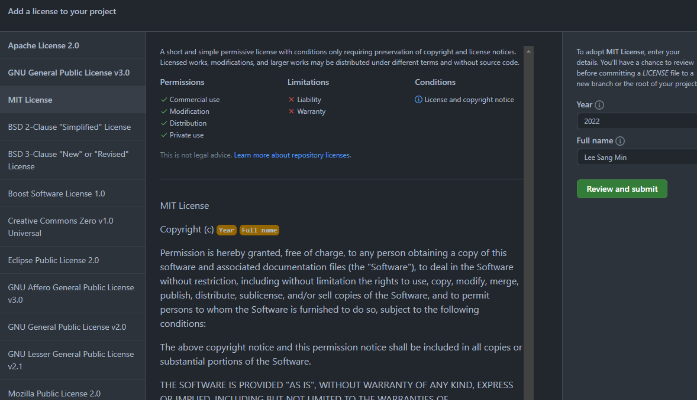

## Getting Started

If you look at many open source repositories on Github, most licenses are specified. I have also used a lot of open source so far, but I think I lacked knowledge about licenses in open source, so I'm going to try to simplify it for proper use of open source.

However, we do not explain the limitations of each license separately, so if you need an explanation about the license, let's check the notice about the license.

In general, there are cases of using open source and cases of distributing open source. Let's take a look at each case.

## If you redistribute (use) open source

The basic obligations of all open source licenses are notice and source code disclosure.

In general (at least on github), the restrictions on the license are indicated through the `LICENSE.md` (or `LICENSE`) file and the license is notified in the `README.md` file, so you can follow the restrictions of the license. Let's look at the example below.

The blog, morethan\_log, is a project created by redistributing Nobelium. As described in the README.md file of Nobelium, the project follows the MIT License, and the original author is listed in the README.md file of morethan\_log in accordance with the rules described in the LICENSE file.

### If you do not have a license

If the source code to be used is a source code for which the license is not specified, only the copyright holder has the right to use the code. Therefore, it is necessary to obtain permission for use through a request from the copyright holder of the corresponding code.

## If you are distributing open source

Conversely, if you publish an open source project, how do you define the license? In fact, it would be nice to find out by creating an open source licensor on github.

Create LICENSE through Add file in the Repository where you want to apply the license.

When the file name is entered as LICENSE, the Choose a license template button appears as follows.

Here, you can see the description of each license, select and create a license suitable for your open source. 🙂

## **concluding**

There were many cases where I didn't pay attention to the license because it was annoying, but from now on, I'm going to keep it and use open source.
